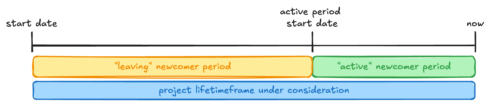

# What is a newcomer

We consider as newcomer every user whose first patchset was made within a date range defined by a certain date
and the current date.

This information classifies contributors (newcomers) as Active or Leaving. We can say a
newcomer is leaving when its last contribution was made before a defined time period.

By default, we are taking 90 days as threshold, which means:

- Any newcomer whose last contribution was more than 90 days ago will be considered as a leaving newcomer.
- Otherwise, it will be an active newcomer.

